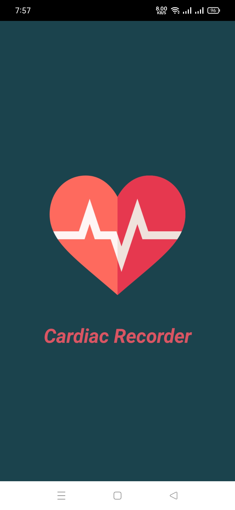
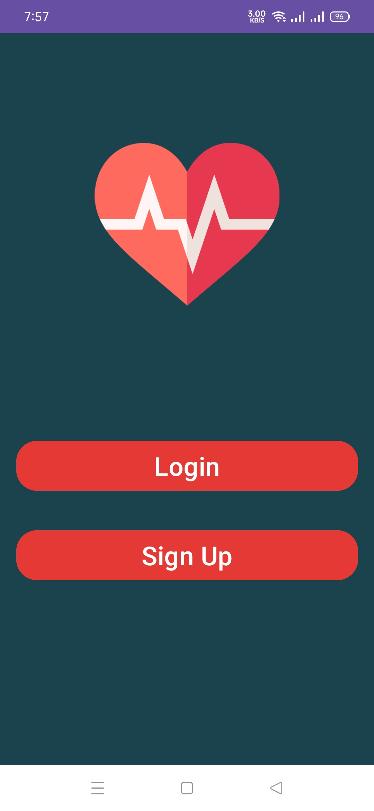
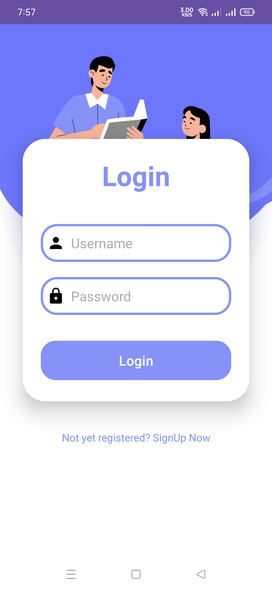
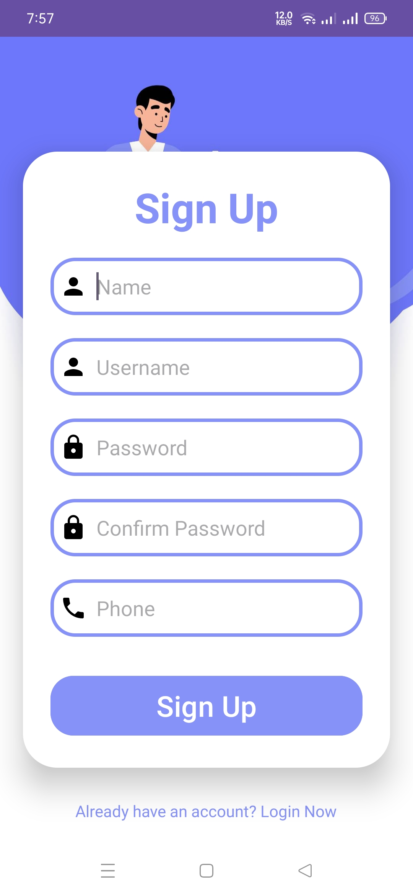
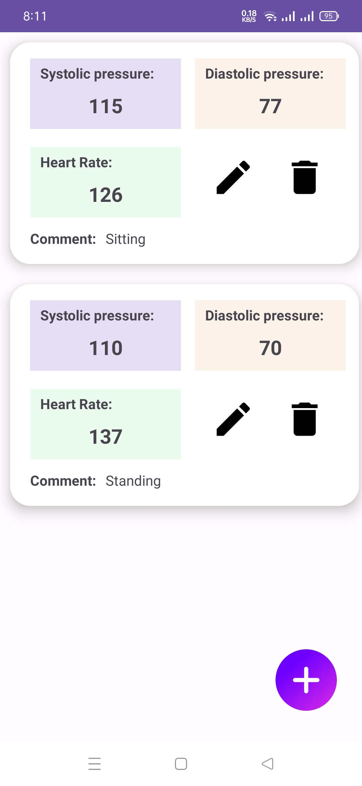
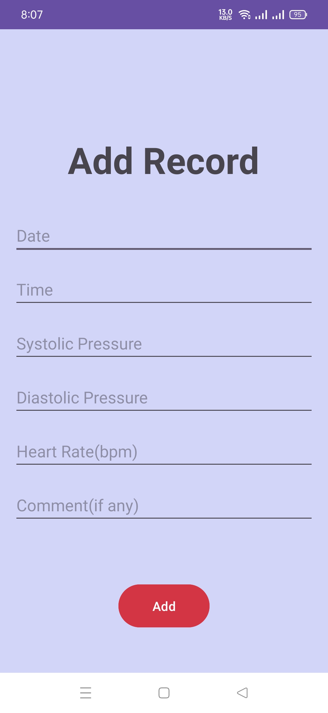
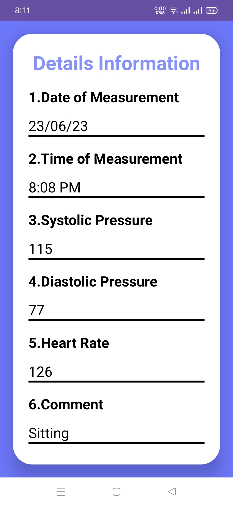
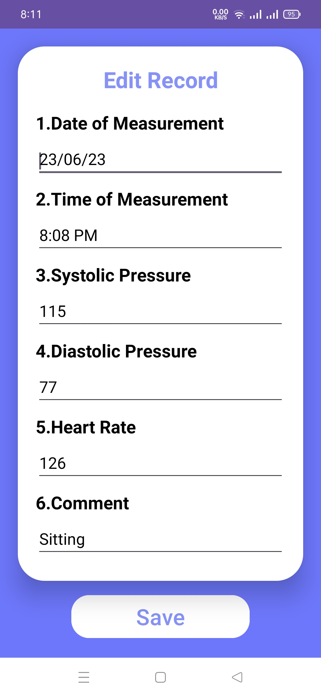

# Cardiac-Recorder

CardiacRecorder is an intuitive and efficient Android application that enables users to effortlessly track their heart rate, blood pressure and physical condition for optimal health monitoring.

# Introduction

In an era where individuals are increasingly prioritizing their health and well-being, monitoring one's heart rate and blood pressure at various intervals has become a sought-after daily practice. Recognizing this growing need, our app, 'CardiacRecorder,' aims to assist people in this regard.

'CardiacRecorder' provides a user-friendly interface that effortlessly caters to users of all backgrounds. With its range of features, the app provides an experience for individuals seeking to monitor and maintain their cardiovascular health.

## Objectives
* To accurately capture and monitor the systolic and diastolic blood pressure readings of users.
* To effectively track and record the heart rate of users.

## Screenshots

<table>
  <tr> 
    <td></td>
    <td></td>
    <td></td>
  </tr>
  <tr>
    <td></td>
    <td></td>
    <td></td>

  </tr>
  <tr>
    <td></td>
    <td></td>
    <td></td>

  </tr>

</table>

## More details

More details about this android application project can be found <a href="https://github.com/Alastor7676/Cardiac-Recorder/wiki">here</a>
